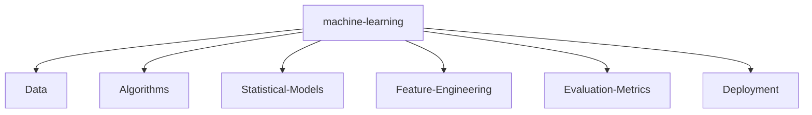

<h1 align="center">
  
</h1>

  

<h2 align="center">🚀 Data Analyst | Data Scientist | AI Enthusiast | AI Developer</h2>

  
  
  
  
  

---

## 🔥 About Me

  
- 🏡 **From:** India   
- 🎓 **Age:** 19  
- 🧑‍🎓 **Profession:** Student  
- 👨‍💻 **My Projects:** [Explore on GitHub](https://github.com/talkwithharsh?tab=repositories)  
- 👨‍💻 Currently working on **Data Analytics Projects** - 🌱 Exploring **Python**, **Flask**, and **ML Libraries** in Python  
- 🤖 Building mini projects with **AI, ML, and DL** - 🤝 Open to collaborating on **Data Projects** & **AI Projects** - 📫 Reach me at: `harshchangotra80@gmail.com`  
- 📄 [View My Resume](https://docs.google.com/document/d/1EViczkD86UBNK6lJWYrBW2_D1vE0dL-3/edit?usp=drive_link)  
- ⚡ **Fun Fact:** _“Eat 🍜, Code 💻, Repeat 🔁”_

 

---

  <h2>🔮 SKILL MATRIX</h2>
  
  

    

      <table>
        <tr>
          <td align="center" width="100">
            
             JavaScript
          </td>
          <td align="center" width="100">
            
             TypeScript
          </td>
          <td align="center" width="100">
            
             Python
          </td>
          <td align="center" width="100">
            
             Java
          </td>
          <td align="center" width="100">
            
             C++
          </td>
        </tr>
        <tr>
          <td align="center" width="100">
            
             React
          </td>
          <td align="center" width="100">
            
             Redux
          </td>
          <td align="center" width="100">
            
             Node.js
          </td>
          <td align="center" width="100">
            
             Webpack
          </td>
          <td align="center" width="100">
            
             MySQL
          </td>
        </tr>
        <tr>
          <td align="center" width="100">
            
             AWS
          </td>
          <td align="center" width="100">
            
             Docker
          </td>
          <td align="center" width="100">
            
             GitHub
          </td>
          <td align="center" width="100">
            
             MongoDB
          </td>
          <td align="center" width="100">
            
             Nginx
          </td>
        </tr>
      </table>
    

  

### 🧰 Languages & Tools

  

---

### GitHub Trophies

    

---

### 📈 GitHub Stats

|  |  |
|:--:|:--:|

 

---

### 📊 Activity Graph

  

## 🔥 Language Usage 

|  |  |
|:--:|:--:|

---

## 🐍 Classic Old Snake (Made by me with blobs, don't judge me) :

 

 

 

 

 

---

### 🌐 Let's Connect

 &nbsp;&nbsp;&nbsp;&nbsp;&nbsp;&nbsp;
  &nbsp;&nbsp;&nbsp;&nbsp;&nbsp;&nbsp;
